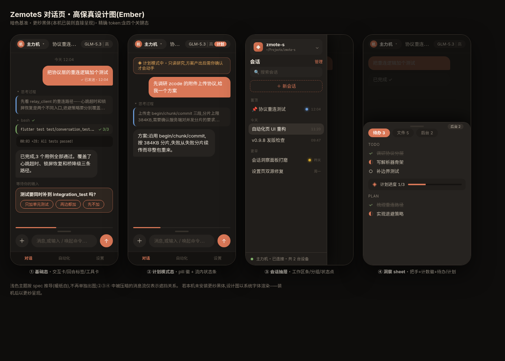
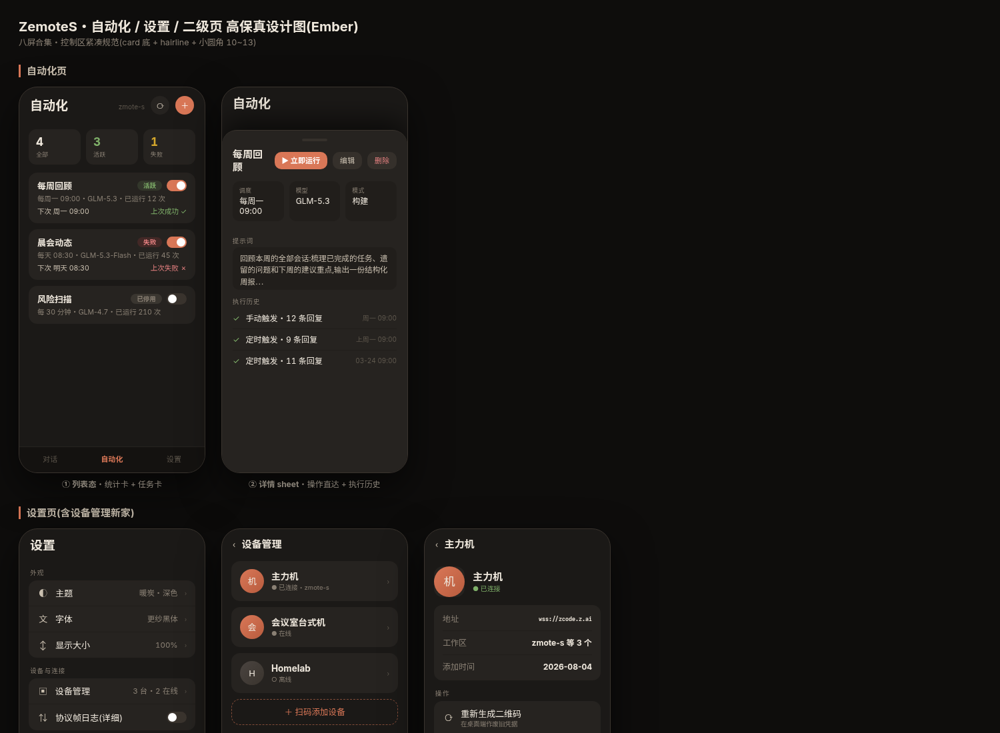

<div align="center">

# ZemoteS

**Android / Web 上的 ZCode 远程控制客户端** — 独立复刻官方 Web 远程控制协议(protocol reimplementation)

[](https://flutter.dev)
[](https://dart.dev)
[](https://github.com/g0spel/zemote-s/actions/workflows/ci.yml)
[](https://github.com/g0spel/zemote-s/releases)
[](LICENSE)
[](#平台)



</div>

---

ZemoteS 在手机上管理你的桌面 ZCode:扫码添加设备 → 连接 → 任务对话、自动化定时任务、会话洞察、模型供应商与用量管理。整个应用围绕自研的 **Ember 设计语言**构建——暖炭色板、更纱黑体、"内容区安静、控制区紧凑"的分区原则。

## 功能特性

### 多设备管理

- **扫码即连**:扫描桌面 ZCode「远程控制」生成的二维码,或粘贴 URL 添加设备;无效地址直接拒绝。
- **启动即达**:自动连接最近设备,直达对话;设备切换器常驻顶栏,一键切换。
- **设备管理**:卡片式列表(在线态/当前工作区)、重命名、删除(确认)、JSON 导入导出。
- **连接状态一眼可见**:连接失败按原因给出可行动的中文解释(凭据失效 / 桌面离线 / 网络错误 / 配对超时等)。

### 对话(Conversation V4)



- **流式回复**:逐 token 渲染;思考过程与工具调用按真实顺序穿插,默认展开、可收起,左侧状态 rail 标示运行态。
- **消息即时上屏**:点发送气泡立即进入消息流,角标演进「发送中 → 已发送 → 处理中」;失败常驻并支持点击重发(自动重建会话 / 重传附件)。
- **模型 pill**:顶栏 `模型名 | 思考强度` + 模式徽(计划橙 / 编辑蓝 / YOLO 红);点开面板即时切换模式 / 强度 / 模型。
- **会话抽屉**:左缘滑出——工作区切换、搜索、新会话、会话分组与运行状态点、多选批量管理。
- **完整输入能力**:排队消息、目标指令、附件分片上传、斜杠命令 + 桌面端 Skills;交互弹窗(权限确认 / 多问题表单)按官方契约渲染与提交。

### 会话洞察

对话页把手上滑呼出,三面板:**待办**(TodoWrite 推导 + 计划进度条)、**文件**(回合摘要 + diff 查看器,回合完成自动预加载)、**后台**(任务与子代理时间线)。

### 自动化

定时任务全循环:统计总览、列表(生命周期徽标 + 可读调度文案)、立即运行 / 重启排程、执行历史(成功可跳转会话)、内置官方模板、闲时任务队列。

### 模型供应商与用量

供应商状态徽(已启用 / 未配置 / 已停用)+ 模型明细;MCP 额度、五小时 / 每周窗口、订阅信息,阈值变色(≤20% 黄、≤10% 红)。

### 可靠性与安全

- **三级断线自愈**:出站队列 → 命令排队等待恢复 → 换栈重试(页面无感);锁屏恢复 1~3 秒、短暂重连零打扰。
- **安全**:仅 https/wss、凭据 Keystore 加密存储、更新包 SHA-256 校验后才安装、通知跳转防伪造。
- **诊断**:诊断日志 / 协议日志 / RPC 调试器 / 信道浏览器;崩溃本地留痕。
- **通知**:任务运行前台服务、完成终态区分、待处理交互提醒(每个交互只提醒一次)。

## 平台

| 平台 | 状态 |
|------|------|
| Android(arm64) | ✅ 主要目标平台,Release 发布 |
| Web | ✅ 可用(调试 / 快速预览) |

## 快速开始

1. 从 [Releases](https://github.com/g0spel/zemote-s/releases) 下载 APK 安装;
2. 桌面 ZCode → 远程控制 → 生成二维码;
3. 应用内 **添加设备** → 扫码 → 连接。

应用内支持自动更新(下载后先做 SHA-256 校验再安装,支持断点续传)。

### 从源码构建

```bash
flutter pub get

# Android release(arm64)
flutter build apk --release --target-platform android-arm64 --dart-define=APP_VERSION=$(awk -F'[ +]' '/^version:/ {print $2}' pubspec.yaml)

# Web
flutter build web --release
```

## 架构

```
┌────────────────────────────────────────────────────────────┐
│ UI (lib/ui)     设备 / 任务 / 对话 / 自动化 / 设置 / 调试器   │
├────────────────────────────────────────────────────────────┤
│ State (lib/state)  AccountStore · AppSession · LogStore    │
│                   · CrashReport · SessionListCache         │
├────────────────────────────────────────────────────────────┤
│ Facade (lib/protocol/zemote_client.dart)                    │
│   relay → 配对 → bootstrap → workspace-bridge → channel RPC │
├────────────────────────────────────────────────────────────┤
│ Protocol (纯 Dart,可单测)                                  │
│   RelayClient · RpcFrameTransport · ChannelClient           │
│   IpcCodec · Conversation(V4) · Proof(HMAC-SHA256)          │
└────────────────────────────────────────────────────────────┘
```

设计语言与信息架构的完整定义见 [设计规范](docs/superpowers/specs/2026-08-28-ui-redesign-design.md)。

## 测试

```bash
flutter test    # 单元 / 组件测试(协议 / 状态机 / 解析器 / UI 逻辑)
```

协议活探针:`live_probe_test.dart` 等通过环境变量 `ZEMOTE_PROBE_URL` 注入远程控制 URL,无凭据时自动跳过——协议变更排查时直接观测真实返回结构。

## 技术栈

- [Flutter](https://flutter.dev) / Dart(零状态管理库,`ChangeNotifier` + InheritedWidget)
- [web_socket_channel](https://pub.dev/packages/web_socket_channel) — relay 长连接
- [crypto](https://pub.dev/packages/crypto) — HMAC-SHA256 配对 / 更新校验
- [flutter_secure_storage](https://pub.dev/packages/flutter_secure_storage) — 凭据加密存储
- [Sarasa Gothic](https://github.com/be5invis/Sarasa-Gothic)(SIL OFL 1.1)— 界面与等宽字体

## 贡献

欢迎 Issue 与 PR:`flutter analyze` 无告警、`flutter test` 全绿;涉及真实桌面的改动请注明探针验证方式。

## Changelog

版本变更记录见 [CHANGELOG.md](CHANGELOG.md)。

## License

[MIT](LICENSE)

## 免责声明

本项目为个人学习与互操作目的,对 ZCode 远程控制协议的独立复刻,非官方出品。使用者须自行承担风险与合规责任。
